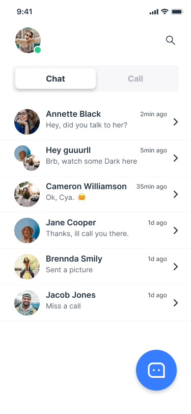

# Talky: A Flutter Chat App

**Talky** is a feature-rich chat application built using Flutter. It provides users with real-time messaging, seamless user authentication, and a clean, intuitive design. The app leverages Firebase for backend services and ensures a smooth chatting experience.

## Features

* **Real-Time Messaging:** Send and receive messages instantly with real-time updates.
* **User Authentication:** Secure login and sign-up using Firebase Authentication.
* **Chat Rooms:** Engage in one-on-one conversations or group chats.
* **Media Sharing:** Share images, videos, and files with other users.

## Technologies

* **Flutter:** Google's UI toolkit for building natively compiled applications for mobile, web, and desktop from a single codebase.
* **Dart:** Programming language optimized for building cross-platform apps with Flutter.
* **Firebase:** Backend services for user authentication, real-time database, and cloud storage.

## Screenshots

| Splash Screen       | Sign in with Social Screen       | Sign in Screen       | Sign Up Screen       | Profile Screen       | Home Screen       | Chat Screen       |
| ----------------- | ------------------ | --------------------- | ------------------ | --------------------- | ------------------ | --------------------- |
|  |  |  |  |  |  |  |

## Getting Started

### Prerequisites
* Flutter SDK (version 3.0 or higher)
* Dart SDK (version 2.0 or higher)
* Firebase account for authentication and real-time database
* A code editor like VSCode or Android Studio

### Installation


1. Clone the repository:
   ```bash
   git clone [the repo url]
2. Navigate to the project directory:
   ```bash
   cd clima_app
3. Install dependencies:
   ```bash
   flutter pub get

4. Configure Firebase:
 - Create a Firebase project and enable Authentication, Firestore, and Cloud Storage.
 - Add the Firebase configuration file to your project.
5. Run the app on an emulator or physical device::
   ```bash
   flutter run

### Contributing
We welcome contributions to AL24News! Please refer to our contribution guidelines for details.

### License
This project is licensed under the raufzer license.
